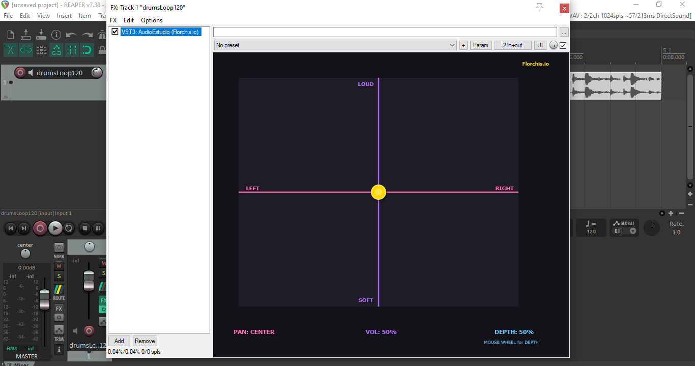

# 🎛️ AudioEstudio 

**VST3 plugin** for REAPER and other DAWs that allows control of sound .

## ✨ Features

| Control | Function |
|---------|----------|
| **X axis (horizontal)** | Left/Right panning |
| **Y axis (vertical)** | Volume (Up/Down) |
| **Mouse Wheel** | Depth (Close/Far) |

## 🎨 Visual Design

- **Pink line** → Panning reference (LEFT / RIGHT)
- **Purple line** → Volume reference (LOUD / SOFT)
- **Gold ball** → Interactive cursor (size changes with depth)
- **Cyan text** → Depth status (CLOSE / FAR)

## 🛠️ Installation

1. Download `AudioEstudio.vst3` from [Releases](../../releases)
2. Copy to your VST3 folder:
   - **Windows:** `C:\Program Files\Common Files\VST3\`
   - **macOS:** `/Library/Audio/Plug-Ins/VST3/`
3. Scan plugins in your DAW

## 🎮 How to Use

- **Drag the gold ball** → Control Pan (← →) + Volume (↑ ↓)
- **Mouse Wheel** → Control Depth (CLOSE / FAR)
- **Right sliders** → Fine adjustments

## 🖥️ Compile from Source

1. Clone the repository
2. Open `.jucer` file with Projucer
3. Export to Visual Studio
4. Build in Release mode

## 👤 Author

**Florchis.io**

---

*Made with JUCE framework*
